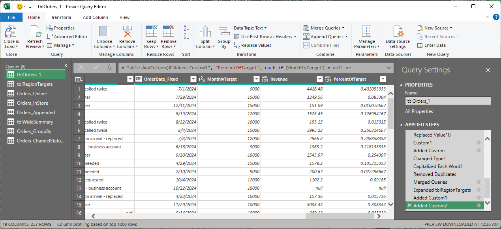
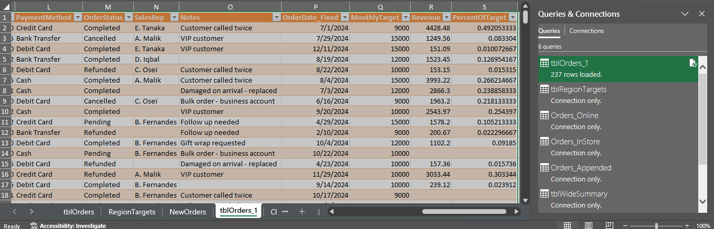
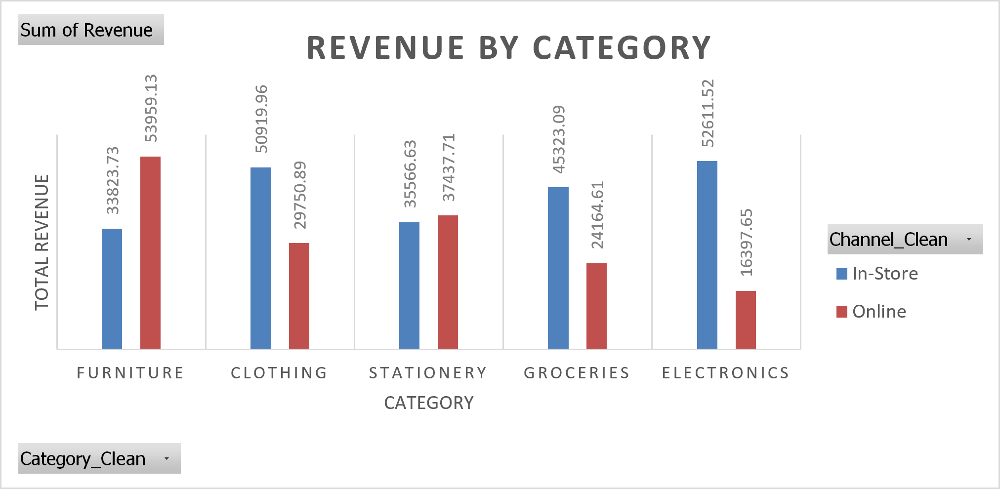
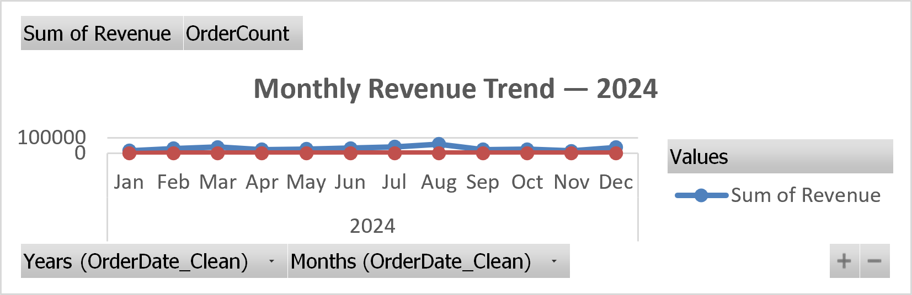
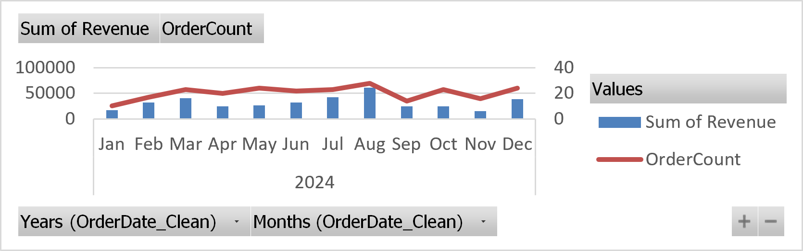
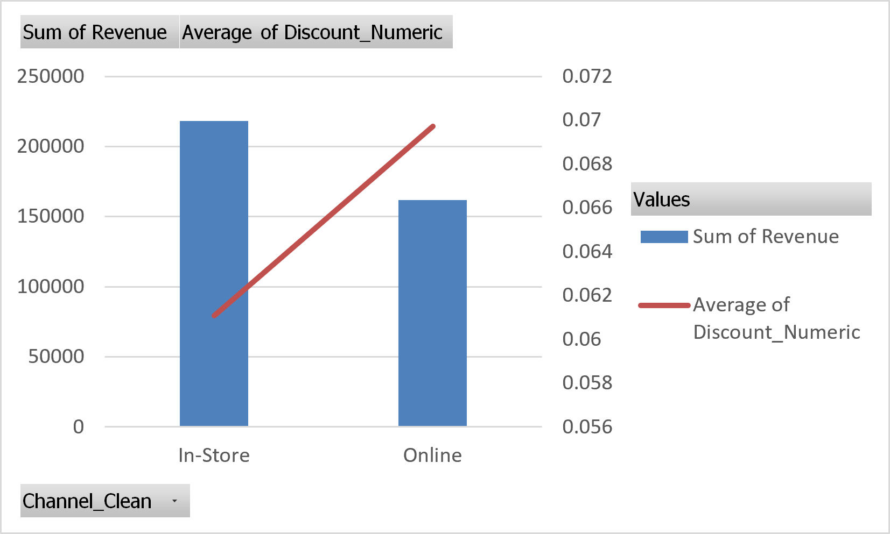
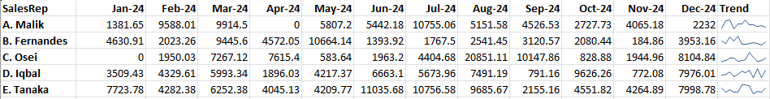

# Sales & Order Analytics — Microsoft Excel

## Project Overview

This project demonstrates an end-to-end **sales and order analytics workflow in Microsoft Excel**, covering data cleaning, transformation, validation, analysis, automation, and visualization.

The project was built using a deliberately messy transactional sales dataset and focuses on converting raw data into a clean, analysis-ready format using **Excel formulas, Power Query, PivotTables, PivotCharts, and data-quality checks**.

---

## Tools & Skills Used

- Microsoft Excel 2022
- Power Query
- Excel Tables & Structured References
- PivotTables
- PivotCharts
- Data Validation
- Conditional Formatting
- Advanced Excel Formulas
- Charts & Sparklines

---

## Key Concepts Applied

### Data Cleaning & Preparation

Cleaned and standardized inconsistent transactional data including:

- Customer names
- Regions
- Product categories
- Sales channels
- Payment methods
- Order statuses
- Dates
- Quantity
- Unit Price
- Discounts
- Notes

Functions used included:

`TRIM`, `CLEAN`, `PROPER`, `SUBSTITUTE`, `VALUE`, `TEXT`, `EOMONTH`

Additional calculated fields were created for:

- Cleaned dates
- Month labels
- Revenue
- High-value order flags
- Normalized discounts
- Order keys and helper fields

---

## Advanced Excel Formulas

Applied formulas for business analysis and data validation, including:

- `XLOOKUP`
- `VLOOKUP`
- `IF`
- `IFERROR`
- `SUMIFS`
- `COUNTIFS`
- `MAXIFS`
- `FILTER`
- `UNIQUE`
- `SORT`
- `EOMONTH`

These were used for multi-condition analysis, lookups, latest-order identification, dynamic filtering, and revenue calculations.

---

## Power Query ETL Workflow

Built a reusable Power Query transformation process including:

- Data type correction
- Trim and Clean transformations
- Capitalization and standardization
- Null handling
- Date normalization
- Duplicate identification and removal
- Custom calculated columns

### Merge

Merged the Orders dataset with a regional target table using a **Left Outer Join** to add `MonthlyTarget`.

### Append

Combined Online and In-Store order queries vertically using **Append Queries**.

### Unpivot

Converted wide monthly data into a tidy format using **Unpivot Columns**.

### Group By

Created aggregated summaries such as:

- Total Revenue by Category
- Order Count by Category
- Revenue by Channel and Order Status

### Refresh Automation

Tested the complete refresh cycle by adding deliberately messy new records to the source data and using **Refresh All** to automatically reapply all Power Query transformation steps.

---

## PivotTable Analysis

Created PivotTables to analyze:

- Revenue by Category
- Revenue by Channel
- Regional performance
- SalesRep performance
- Payment Method performance
- Order Status distribution
- Monthly Revenue trends
- Average Order Value
- Average Discount by Category
- Region × Category Revenue

---

## Data Quality & Validation

Implemented multiple quality-control checks including:

- Raw vs cleaned row-count reconciliation
- Blank Quantity checks
- Blank Unit Price checks
- Distinct Region checks
- Distinct Order Status checks
- Duplicate identification
- Data Validation dropdowns
- Manual verification of calculated results

This ensured that automated analysis was supported by proper data-quality controls.

---

## Data Visualization

Created multiple Excel visualizations including:

- Clustered Column Charts
- Line Charts
- Horizontal Bar Charts
- Interactive PivotCharts
- Combo Charts
- Secondary Axis Charts
- SalesRep Sparklines
- Category Sparklines

Charts were formatted using clear titles, axis labels, legends, sorting, and simplified business-reporting styles.

---

## Business Analysis Performed

The project enabled analysis of:

- Revenue performance by product category
- Regional sales performance
- Online vs In-Store performance
- SalesRep contribution
- Order Status distribution
- Monthly sales trends
- Payment Method performance
- Discount patterns
- Regional target contribution
- High-value orders

---

## Project Preview

### Power Query ETL Workflow


### Query Architecture


### Revenue by Category


### Monthly Revenue Trend


### Revenue vs Order Count


### Revenue vs Average Discount


### SalesRep Sparklines


## Project Files

```text
sales-order-analytics-excel/
│
├── README.md
│
├── Orders_Working.xlsx
├── Orders_PowerQuery_Practice.xlsx
│
└── assets/
    ├── revenue_by_category.png
    ├── monthly_revenue_trend.png
    ├── revenue_discount_combo.png
    └── sparklines.png
